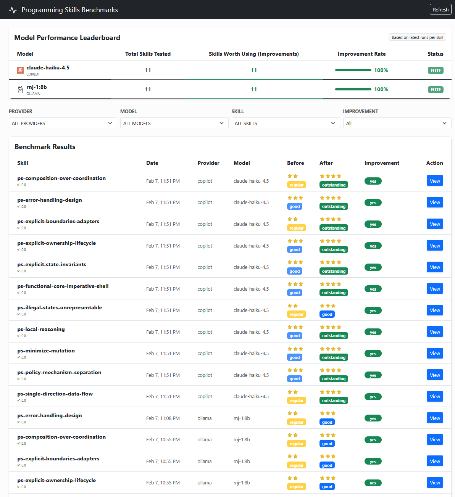
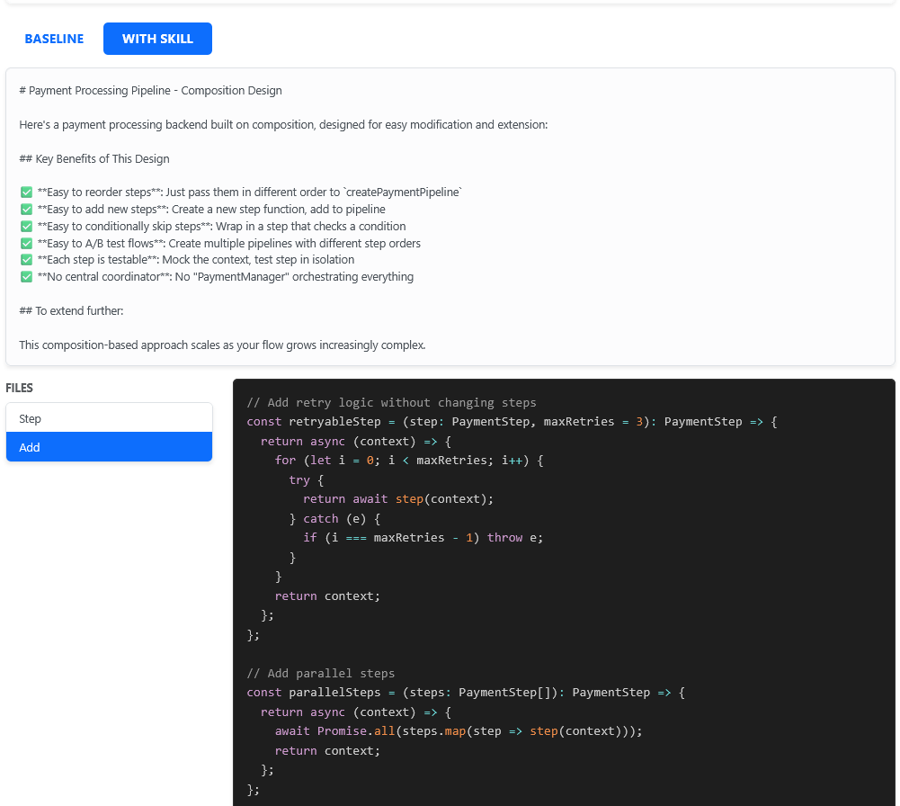
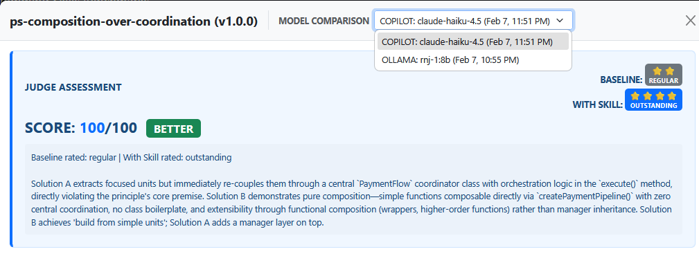

# Programming Skills

Language-agnostic AI agent skills that enforce fundamental programming principles. This repository provides specific, granular instructions that enable AI coding assistants to produce significantly higher-quality code that adheres to robust engineering standards.

| Dashboard Explorer | Code Comparison | Judge Reasoning |
| :---: | :---: | :---: |
|  |  |  |

Adopting these skills measurably changes the output of AI models, shifting them from generating merely functional code to producing architecturally sound solutions.

## Table of Contents

- [Installation](#installation)
- [How it Works](#how-it-works)
- [Validation & Testing](#validation--testing)
- [Evaluation Results](#evaluation-results)
- [Documentation](#documentation)
- [License](#license)

## Installation

See:

- [Install Instructions](docs/install-instructions.md)

## How it Works

The core of this repository is the `skills/` directory. Each skill is encapsulated in its own subdirectory following the `ps-<name>` convention (e.g., `ps-composition-over-coordination`).

We use this granular structure because:

1.  **Focus**: It allows the AI to load only the relevant context for a specific task, avoiding context window pollution.
2.  **Modularity**: Skills can be improved, versioned, and tested independently.
3.  **Composability**: Users can select the specific combination of principles they want to enforce for their project.

## Skill Integration

Skills should live under the `skills/` directory as `SKILL.md` files. For a full integration guide and documentation index:

```
https://agentskills.io/integrate-skills
https://agentskills.io/llms.txt
```

## Validation & Testing

Every skill is validated against a rigorous testing suite found in the `tests/` directory.

- **Automated Judging**: We use an LLM-as-a-Judge approach. The system compares the output of a "Baseline" model (without the skill) against a "Skill" model (with the skill loaded).
- **Semantics over Syntax**: The test does not just look for passing unit tests; it analyzes the _logic_ and _structure_ of the code.
- **Evidence-Based**: The judge identifies the specific lines of code that demonstrate adherence to or violation of the principle.

[Read our Case Study on Judge Fairness](docs/judge-fairness-case-study.md) to see how the system fairly evaluates architectural quality, even when it means failing the Skill model.

## Evaluation Results

Dashboard:

```
https://ariel-rodriguez.github.io/programming-skills/
```

## Documentation

- [Architecture](docs/specs/architecture.md) - Repository design & structure
- [Contributing](docs/contributing.md) - How to add/modify skills & benchmarks
- [AI Prompt Wrapper](docs/ai-prompt-wrapper.md) - Configure your AI assistant
- [Changelog](CHANGELOG.md) - Version history & skill changes

## License

MIT License - see [LICENSE](LICENSE)
